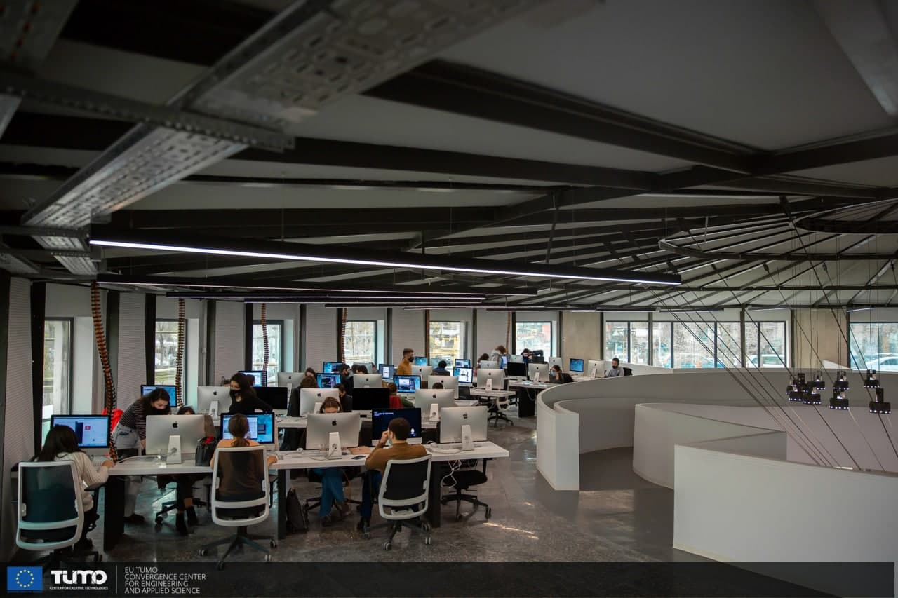

# C Piscine 42 Yerevan

This repository contains coding developed at [42 Yerevan's](https://42yerevan.am/) C bootcamp (also known as `Piscine`), from 31/jan/2022 to 25/feb/2022.

## About 42

	42 is a global education initiative that proposes a new way of learning technology: no teachers,
	no classrooms, students learning from their fellow students (peer to peer learning), with a
	methodology that develops both computing and life skills. The 42 cursus is free for whoever is
	approved in its selection process. The so-called "C Piscine", a 26-day C programming bootcamp,
	is the last stage in the selection process for becoming a "cadet" (42's student).
	

## Skills developed at C Piscine

### Hard-skills
	# C Language
		The primary language learned at the 42's Piscine is C: dealing with variables,
		pointers, memory allocation, macros, as well as creating functions and programs,
		including the use and creation of libraries and Makefiles.

	# Shell
		The first two days of the bootcamp are dedicated to learning basic to intermediate
		shell commands to seamlessly navigate through the terminal.

	# Git
		All projects are submitted via a remote git repository, which demands students to
		be at ease with such a system.

### Soft-skills
	# Self-learning and proactiveness
		At 42, self-learning is at the core of its peer to peer learning methodology. There
		are no teachers whatsoever; the learning process is based on googling, enquiring
		your classmates and empirical knowledge, each student learning at their own pace.

	# Teamwork
		On weekends, a 48h team project called "Rush" is proposed: a 3-member group randomly
		chosen by the school's system must collaboratively develop a fully running application.
		The major challenge here is to equalize the different knowledge levels while finding a
		common work methodology that allows all team members to contribute to the project.

	# Time management and resiliency
		The school is open 24/7. Thus, the so-called "pisciners" are free to work whenever
		they want, which demands excellent time management skills and resiliency for not
		"drowning" amid the massive load of work demanded by the non-stop 26-day program.

## Curriculum

The table below presents the C Piscine's curriculum in chronological order in which it was completed by me - order of completed subjects and corresponding attained level may vary among students.

|#	|SUBJECT							             |LANGUAGE	|DURATION		     |EXPERIENCE	  |STATUS						         |ATTAINED LEVEL	|
|:-:|:--:								               |:-:		    |:--:			       |:--:		        |:--:						           |:--:			        |
|00	|Create intra page			           |N/A		    |-				       |0 XP		      |100% :heavy_check_mark:	 |level 0 - 0%	  |
|01	|Exam 00							             |C			    |about 2 hours	 |225 XP		    |64% :heavy_check_mark:		 |level 1 - 23% 	|
|02	|[Shell 00](./Shell00)	 |Shell		  |about 1 day	   |100 XP		    |100% :heavy_check_mark:	 |level 2 - 01%  	|
|03	|[Rush 00](./Rush00)		 |C			    |2 days			     |150 XP		    |116% :heavy_check_mark:   |level 3 - 18%   |
|04	|[C 00](./C00)		       |C			    |about 1 day	   |100 XP		    |96% :heavy_check_mark:	   |level 3 - 75%	  |
|05	|[C 01](./C01)			     |C			    |about 1 day	   |100 XP		    |100% :heavy_check_mark:	 |level 4 - 32%	  |
|06	|[C 00](./C00)		       |C			    |about 1 day	   |100 XP		    |100% :heavy_check_mark:	 |level 4 - 35%	  |
|07	|Exam 01							             |C			    |about 3 hours	 |225 XP		    |64% :heavy_check_mark:		 |level 5 - 10%	  |
|08	|[C 03](./C03)			     |C			    |about 1 day	   |100 XP		    |50% :heavy_check_mark:	   |level 5 - 33%	  |
|09	|[C 02](./C02)			     |C			    |about 1 day	   |100 XP		    |85% :heavy_check_mark:		 |level 5 - 73%	  |
|10	|[C 03](./C03)			     |C			    |about 1 day	   |100 XP		    |75% :heavy_check_mark:	   |level 5 - 84%	  |
|11	|[C 04](./C04)			     |C			    |about 1 day	   |100 XP		    |70% :heavy_check_mark:	   |level 6 - 07%	  |
|12	|[Rush 01](./Rush01)		 |C			    |2 days			     |150 XP		    |100% :heavy_check_mark:	 |level 6 - 70%	  |
|13	|[C 06](./C06)			     |C			    |about 1 day	   |100 XP		    |100% :heavy_check_mark:	 |level 7 - 10%	  |
|14	|[Shell 01](./Shell01)	 |Shell		  |about 1 day	   |100 XP		    |100% :heavy_check_mark:	 |level 7 - 47%	  |
|15	|[C 05](./C05)			     |C			    |about 1 day	   |100 XP		    |90% :heavy_check_mark:	   |level 7 - 80%	  |
|16	|[C 03](./C03)			     |C			    |about 1 day	   |100 XP		    |100% :heavy_check_mark:	 |level 7 - 89%	  |
|17	|Exam 02							             |C			    |about 4 hours	 |225 XP		    |84% :heavy_check_mark:		 |level 8 - 51%	  |
|18	|[C 04](./C04)			     |C			    |about 1 day	   |100 XP		    |85% :heavy_check_mark:	   |level 8 - 62%	  |
|19	|[C 07](./C07)			     |C			    |about 1 day	   |100 XP		    |60% :heavy_check_mark:    |level 8 - 82%  	|
|20	|[Rush 02](./Rush02)		 |C			    |2 days			     |150 XP		    |105% :heavy_check_mark:   |level 9 - 29%  	|
|21	|[C 08](./C08)			     |C			    |about 1 day	   |100 XP		    |70% :heavy_check_mark:    |level 9 - 49%  	|
|22	|Final Exam							           |C			    |about 8 hours	 |375 XP		    |72% :heavy_check_mark:		 |level 10 - 23%  |
